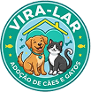

# [🐶 Vira-Lar — Plataforma de Adoção de Pets](https://vira-lar.netlify.app/)

 <div>  <p align="left"> O <strong>Vira-Lar</strong> é uma plataforma web desenvolvida para conectar animais que precisam de um lar a pessoas dispostas a adotar. <br/><br/> Este projeto foi criado como parte de um processo de aprendizado em <strong>desenvolvimento front-end</strong>, com foco em: <br/> ✔️ Trabalho em equipe ✔️ Versionamento de código com Git ✔️ Boas práticas de organização e arquitetura de projetos </p> </div>

---

#### 🚀 Tecnologias Utilizadas

- **HTML5:** Estruturação semântica das páginas.
- **CSS3:** Estilização personalizada com foco em responsividade.
- **JavaScript:** Manipulação dinâmica do DOM para interatividade.
- **Bootstrap:** Componentes para padronização e agilidade no desenvolvimento

#### 📋 Requisitos do Projeto

O projeto cumpre os seguintes **critérios técnicos**:

- **🏠Página Home**: Ponto de entrada do site _(na raiz do projeto)_.
- **👥 Página Sobre**: Apresentação dos desenvolvedores com fotos e descrições.
- **📞 Página Contato**: Formulário com campos básicos.
- **⚙️ DOM**: Pelo menos uma funcionalidade dinâmica via JavaScript.
- **📁 Organização**: Arquivos CSS, JS e páginas secundárias organizados em pastas específicas.

#### 🎯 Objetivo

Criar uma plataforma onde usuários possam:

- 🐕 Visualizar pets disponíveis para adoção
- 📖 Acessar conteúdos e orientações
- 📩 Entrar em contato com a equipe
- 👥 Conhecer os desenvolvedores por trás do projeto

---

### 📁 Estrutura do repositório do projeto

```├── 📁 src
│   ├── 📁 assets
│   │   └── 📁 img
│   │       ├── 📁 banner
│   │       ├── 📁 bichos
│   │       ├── 📁 illustrations
│   │       ├── 📁 logotipo
│   │       ├── 📁 profile
│   │       └── 📁 qrcode
│   │
│   ├── 📁 pages
│   │   ├── 📁 pets
│   │   ├── 🌐 blog.html
│   │   ├── 🌐 contato.html
│   │   ├── 🌐 galeria_pets.html
│   │   └── 🌐 sobre.html
│   │
│   ├── 📁 scripts
│   │   ├── 📄 carousel-gallery.js
│   │   ├── 📄 carousel-home.js
│   │   └── 📄 carousel.js
│   │
│   └── 📁 styles
│       ├── 📁 components
│       ├── 📁 pages
│       ├── 🎨 main.css
│       └── 📝 READMEs internos
│
├── ⚙️ .gitignore
├── 📝 README.md
└── 🌐 index.html
```

### 🛠️ Boas Práticas Implementadas

##### 🔀 Git Flow

Para organização e colaboração eficiente:

- **Branches por funcionalidade**
  - Ex: `feature/form-contato`
- **develop**
  - Integração das funcionalidades em desenvolvimento
- **main**
  - Versão estável do projeto

#### **Conventional Commits**

As mensagens de commit seguem o padrão profissional:

- feat: Adição de uma nova funcionalidade.
- style: Alterações de estilização e CSS.
- fix: Correção de bugs ou erros.
- docs: Mudanças na documentação.

---

### 👥 Colaboradores

O projeto foi fruto de um esforço coletivo onde cada integrante contribuiu com uma parte essencial do sistema:

<table>
<tr align="center">
  <td></td>
  <td></td>
  <td></td>
  <td></td>
  <td></td>
  <td></td>
</tr>
<tr align="center">
  <td>Gabriel</td>
  <td>Enzo</td>
  <td>João</td>
  <td>Kenny</td>
  <td>Lucas</td>
  <td>Mario</td>
</tr>
<tr align="center">
  <td><a href="https://github.com/Gabrielw342">GitHub</a></td>
  <td><a href="https://github.com/EnzoBCCosta">GitHub</a></td>
  <td><a href="https://github.com/joaopedrobr3">GitHub</a></td>
  <td><a href="https://github.com/kennypavelka">GitHub</a></td>
  <td><a href="https://github.com/Phonedison">GitHub</a></td>
  <td><a href="https://github.com/MJPraun">GitHub</a></td>
</tr>
</table>

#### Divisão das tarefas:

| Colaborador | Responsabilidade                                                    |
| :---------: | :------------------------------------------------------------------ |
|   Gabriel   | Páginas de cada Pets (html / css)                                   |
|    Enzo     | Página de Contato e formulário (html / css)                         |
|    João     | Página de galeria de Pets (html / css)                              |
|    Kenny    | Página de galeria de Pets (html / css)                              |
|    Lucas    | Página Home / navbar / footer e organização do projeto (html / css) |
|    Mario    | Página Sobre (html / css)                                           |
